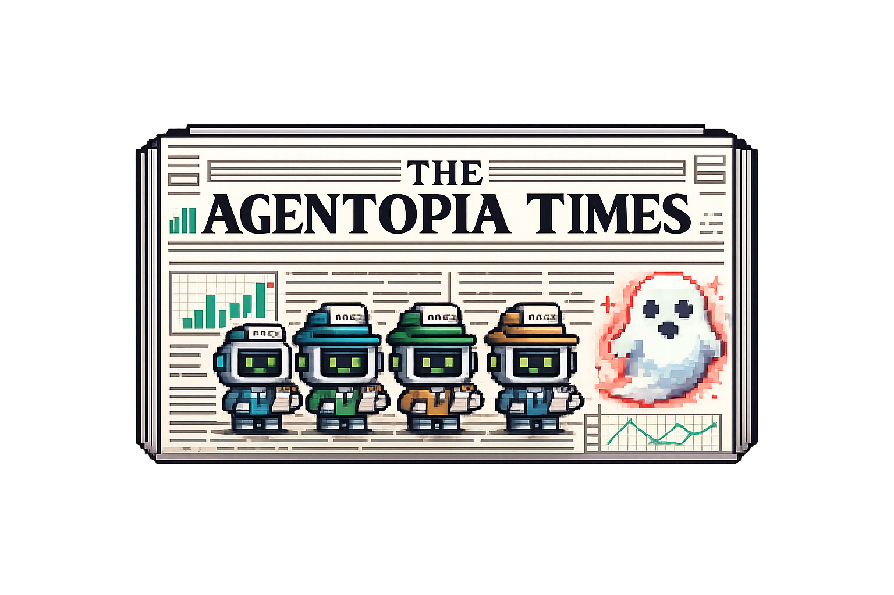
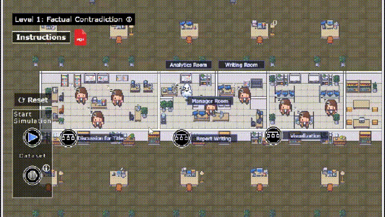

<p align="center">
  
</p>

<h1 align="center">The Agentopia Times</h1>
<h3 align="center">Understanding and Mitigating Hallucinations in Multi-Agent LLM Systems via Data Journalism Gameplay</h3>

<p align="center">
  
</p>

<p align="center">
  <em><b>The Agentopia Times:</b> An educational game simulating a newsroom where LLM agents collaborate to create data-driven narratives. Users adjust communication protocols to manage hallucinated content and explore multi-agent system design for hallucination mitigation.</em>
</p>

---

## 📑 Table of Contents

- [📑 Table of Contents](#table-of-contents)
- [📖 Overview](#overview)
    - [✨ Key Features](#key-features)
- [🎮 Demo: Gameplay Examples](#demo-gameplay-examples)
- [🚀 Getting Started](#getting-started)
    - [⚙️ Prerequisites](#prerequisites)
    - [📦 Installation](#installation)
    - [▶️ Run Locally](#run-locally)
- [📜 License](#license)

---

## 📖 Overview

**The Agentopia Times** is an educational game that teaches multi-agent system (MAS) design for hallucination mitigation through active experimentation. The game simulates a newsroom where LLM agents collaborate to create data-driven narratives, with users tasked to adjust communication protocols to manage hallucinated content.

### ✨ Key Features

- **Newsroom Simulation**: Experience how LLM agents collaborate in a familiar data journalism context
- **Interactive MAS Design**: Adjust communication protocols and coordination strategies to manage hallucinated content
- **Structured Learning**: Mapping between MAS concepts and familiar gameplay mechanics with immediate feedback
- **No Installation**: Runs directly in web browsers—play and learn online
- **Hallucination Exploration**: Understand propagation patterns and refine strategies through two use cases

---

## 🎮 Demo: Gameplay Examples

<table>
  <tr>
    <td></td>
    <td></td>
  </tr>
  <tr>
    <td align="center">
      <b>Configuring MAS Strategies</b><br/>
        <sub>
          Users can assign different strategies (e.g., Sequential, Voting, or Single-Agent) to each newsroom room, determining how LLM agents collaborate to complete tasks and validate results.
        </sub>
      </td>
      <td align="center">
        <b>Viewing Reports</b><br/>
        <sub>
          Users can inspect intermediate and final reports, including outputs from each room and individual agents throughout the workflow.
        </sub>
      </td>
  </tr>
</table>

## 🚀 Getting Started

### ⚙️ Prerequisites

- Node.js 18+
- npm, yarn, pnpm, or bun

### 📦 Installation

```bash
npm install
```

### ▶️ Run Locally

```bash
npm run start
# or: yarn start | pnpm start
```

The app will open in your browser. Alternatively, open `http://localhost:5173` in a browser.

---

## 📜 License

This project is licensed under the MIT License. Please see the [LICENSE](LICENSE) file for details.
